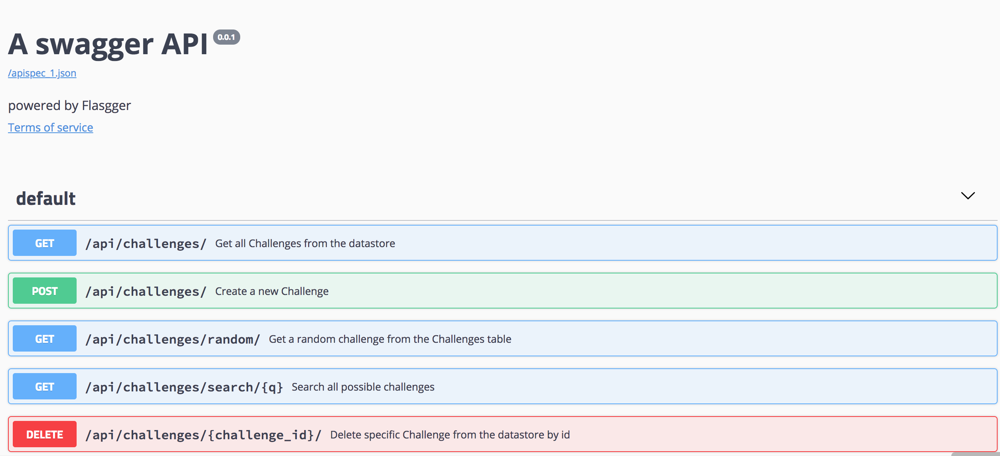

# ChallengeMe

This is the backend for the ChallengeMe application for the Cornell AppDev final hackathon course in Fall 2018

[Frontend Repo](https://github.com/seancorc/ChallengeMe)

To set up the backend, first install necessary dependencies

`pip install -r src/requirements.txt`

To run the flask server

`python3 src/routes.py`

The initial database is within the "CHALLENGEME.db" sqlite file. To reset this database, first

`rm CHALLENGEME.db`

then re run the seeder with  

`python3 seed.py`

# API Details 
This application uses the flask version of the Swagger UI called [Flasgger ](https://github.com/rochacbruno/flasgger). by going to `localhost:5000/apidocs` with the flask server running, you will get a detailed view of each of the api endpoints, and have the ability to directly interact with the requests. Details of the requests are stored in the `docs` folder in `.yml` files. 

